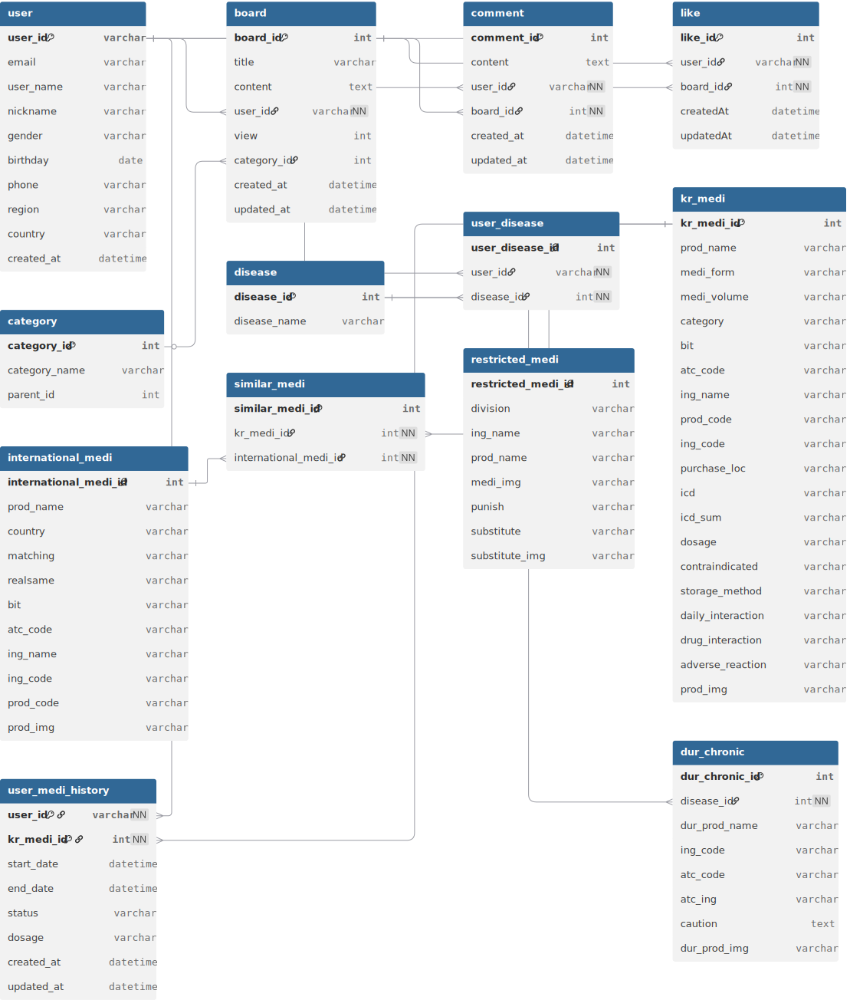

# Mediport-back

Mediport 백엔드 서버입니다.  
외국인 근로자 및 다문화 가정을 위한 **다국어 의약품 정보 제공·커뮤니티 플랫폼**으로,  
사용자의 건강 정보 관리, 약물 추천, 번역 및 커뮤니티 기능을 제공합니다.  

---

## ✨ 주요 기능

- **증상별 일반의약품 추천 챗봇**  
  사용자가 입력한 증상을 분석해 관련 일반의약품을 추천합니다.  
  → 자연어 입력 처리 + 의약품 데이터베이스(`kr_medi`) 매칭 로직  

- **모국약 유사 약품 매칭 서비스**  
  해외 약품명을 검색하면 국내 성분 기반 유사 약품을 추천합니다.  
  → `international_medi` ↔ `kr_medi` 매핑  

- **의료기관 음성 통역 서비스**  
  환자와 의료진 간 실시간 대화를 인식하고 번역합니다.  
  → Google Speech-to-Text + Translate API + Google Text-to-Speech 

- **처방약 모국어 복약 안내**  
  처방전 이미지를 OCR로 분석해 약명·용법을 추출하고, 사용자의 모국어로 번역하여 제공합니다.  
  → Google Vision API + Google Translate API + 복약 정보 DB  

- **커뮤니티 기능**  
  건강·약품 관련 정보를 공유할 수 있는 게시판, 댓글, 좋아요 기능 제공  
  → 게시글/댓글 CRUD + 좋아요 시스템  

- **반입금지 약품 안내**  
  국내 입국 시 반입이 제한된 약품 정보를 안내합니다.  
  → 금지 약품(`restrict_medi`) DB 기반 조건별 검색 API  

- **병용금기 약품 안내**  
  사용자의 질환·복용 이력에 따라 병용 금기 약품을 안내합니다.  
  → DUR 데이터베이스(`dur_chronic`,`kr_medi`) 활용  

---

## 🗂️ 데이터베이스 ERD

---

## 🛠️ 기술 스택

- **Backend**: Node.js, Express  
- **Database & Cache** : MySQL, Sequelize (ORM), Redis    
- **Authentication** : Firebase Auth 
- **Cloud & AI API** :  
  - Google Cloud Vision (OCR)  
  - Google Cloud Translate (번역)  
  - Google Cloud Speech-to-Text (STT)
- **Documentation & Tools** : Swagger,Postman
